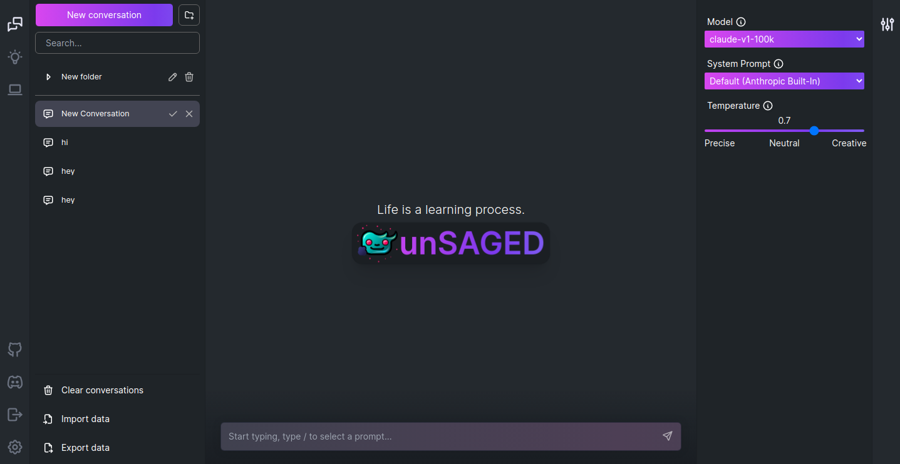

<p align="center">
    
</p>
<a href="https://discord.gg/rMH2acSEzq">
  
</a>




# unSAGED

unSAGED is an advanced chat kit for interacting with AI models. It is built with Next.js and Supabase.


### Step 1. Clone Repo

```sh
git clone https://github.com/jorge-menjivar/unSAGED.git
```

### Step 2. Generate Supabase Tables

Run the [Generation Script](./GenerationScript.sql) in the [Supabase SQL editor](https://app.supabase.com/project/_/sql).

This will do the following:

- Create the tables required by unSAGED.
- Create the authentication schema and tables required by NextAuth.js.
- Enable Row Level Security for the tables required by unSAGED.
- Apply the Row Level Security policies required by unSAGED.

### Step 3. Expose the next_auth schema

Expose the next_auth schema in the [API settings](https://app.supabase.com/project/*/settings/api) by adding next_auth to the "Exposed schemas" list.

More information [here](https://authjs.dev/reference/adapter/supabase#expose-the-nextauth-schema-in-supabase).

### Step 4. Create your auth secret

Create your secret with the following command:

```sh
openssl rand -base64 32
```

copy the output and save it for the next step.

### Step 5. Create a .env.local file

Create a `.env.local` file and set the following variable:

```sh
NEXTAUTH_SECRET=your_secret_from_step_4
```

### Step 6. Install Dependencies

```sh
npm i
```

### Step 7. Run App

Run Locally:

```sh
npm run dev
```

Or run with Docker:

```sh
docker build -t unsaged . --rm
docker run --env-file=.env.local -p 3000:3000 --name unsaged unsaged
```

### (Optional) Step 8. Provide OpenAI API Key

To give everyone using your instance of unSAGED access to any API key, create a `.env.local` file and set the appropriate environment variables:

```sh
OPENAI_API_KEY=YOUR_OPENAI_KEY
ANTHROPIC_API_KEY=YOUR_ANTHROPIC_KEY

```

Notes:

- If you do not provide an API key in the env file, users will have to provide their own key.
- If you don't have an OpenAI API key, you can get one [here](https://platform.openai.com/account/api-keys).
- You can set `OPENAI_API_HOST` where access to the official OpenAI host is restricted or unavailable, allowing users to configure an alternative host for their specific needs.
- Additionally, if you have multiple OpenAI Organizations, you can set `OPENAI_ORGANIZATION` to specify one.

## Configuration

When deploying the application, the following environment variables can be set:

### Env Variables

| Required  | Environment Variable                        | Default value                                       | Description                                                                                                   |
| --------- | ------------------------------------------- | --------------------------------------------------- | ------------------------------------------------------------------------------------------------------------- |
| No        | OPENAI_API_KEY                              |                                                     | The default API key used for authenticating with OpenAI                                                       |
| No        | OPENAI_API_URL                              | `https://api.openai.com/v1`                         | The base url, for Azure use `https://<endpoint>.openai.azure.com`                                             |
| No        | OPENAI_API_TYPE                             | `openai`                                            | The API type, options are `openai` or `azure`                                                                 |
| No        | OPENAI_API_VERSION                          | `2023-03-15-preview`                                | Only applicable for Azure OpenAI                                                                              |
| No        | OPENAI_ORGANIZATION                         |                                                     | Your OpenAI organization ID                                                                                   |
| No        | AZURE_DEPLOYMENT_ID                         |                                                     | Only applicable for Azure OpenAI                                                                              |
| No        | ANTHROPIC_API_URL                           | `https://api.anthropic.com/v1`                      | The base url for the Anthropic API                                                                            |
| No        | ANTHROPIC_API_KEY                           |                                                     | The default API key used for authenticating with Anthropic                                                    |
| No        | NEXT_PUBLIC_DEFAULT_OPENAI_SYSTEM_PROMPT    |                                                     | The default system prompt to use on new conversations for OpenAI models.                                      |
| No        | NEXT_PUBLIC_DEFAULT_ANTHROPIC_SYSTEM_PROMPT |                                                     | The default system prompt to use on new conversations for Anthropic models.                                   |
| No        | DEFAULT_MODEL                               | `gpt-3.5-turbo` _(OpenAI)_ `gpt-35-turbo` _(Azure)_ | The default model to use on new conversations                                                                 |
| No        | NEXT_PUBLIC_DEFAULT_SYSTEM_PROMPT           | [see here](./utils/app/const.ts)                    | The default system prompt to use on new conversations                                                         |
| No        | NEXT_PUBLIC_DEFAULT_TEMPERATURE             | 1                                                   | The default temperature to use on new conversations                                                           |
| Yes       | NEXT_PUBLIC_SUPABASE_URL                    |                                                     | The project URL.                                                                                              |
| Yes       | NEXT_PUBLIC_SUPABASE_ANON_KEY               |                                                     | The supabase project anon key.                                                                                |
| Yes       | SUPABASE_SERVICE_ROLE_KEY                   |                                                     | The supabase project service role key.                                                                        |
| Yes       | SUPABASE_JWT_SECRET                         |                                                     | **Warning!** Generating a new JWT Secret will invalidate all tokens above.                                    |
| No        | NEXTAUTH_EMAIL_PATTERN                      |                                                     | The email regex pattern granted access to unSAGED. For example `.+@mydomain.com`                              |
| Yes       | NEXTAUTH_SECRET                             |                                                     | NextAuth Settings. See [Documentation](https://next-auth.js.org/configuration/options#nextauth_secret)        |
| In prod.  | NEXTAUTH_URL                                | `http://localhost:3000`                             | NextAuth Settings. See [Documentation](https://next-auth.js.org/configuration/options#nextauth_url)           |
| In docker | NEXTAUTH_URL_INTERNAL                       |                                                     | NextAuth Settings. See [Documentation](https://next-auth.js.org/configuration/options#nextauth_url_internal). |
| Yes       | \<PROVIDER\>\_CLIENT_ID                     |                                                     | Provider OAuth Client ID                                                                                      |
| Yes       | \<PROVIDER\>\_CLIENT_SECRET                 |                                                     | Provider OAuth Client Secret                                                                                  |
| Maybe     | \<PROVIDER\>\_ISSUER                        |                                                     | Provider Issuer URL (Only some providers need this)                                                           |

Where \<PROVIDER\> is one of the following:

- APPLE
- AUTH0
- COGNITO
- DISCORD
- FACEBOOK
- GITHUB
- GITLAB
- GOOGLE
- OKTA
- REDDIT
- SALESFORCE
- SLACK
- SPOTIFY
- TWITCH
- TWITTER

For example, to enable Google and Github authentication, you would add the following to your `.env.local` file:

```sh
GITHUB_CLIENT_ID=xxxxxxxxxxxxx
GITHUB_CLIENT_SECRET=xxxxxxxxxxxxx
GOOGLE_CLIENT_ID=xxxxxxxxxxxxx
GOOGLE_CLIENT_SECRET=xxxxxxxxxxxx
```

For Auth0, you would add the following:

```sh
AUTH0_CLIENT_ID=xxxxxxxxxxxxx
AUTH0_CLIENT_SECRET=xxxxxxxxxxxxx
AUTH0_ISSUER=https://mydomain.us.auth0.com
```
