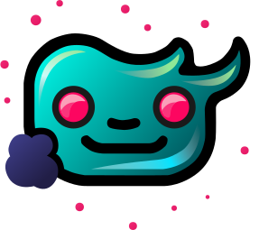

    

# 🎉 Welcome to unSAGED

unSAGED is a cutting-edge chat kit engineered for seamless interaction with AI models. It allows you to easily have conversations with different AI models from a variety of providers, all in one place. It also allows you to manage multiple users and conversations, and synchronize them across different devices.
Leveraging the power of Next.js and Supabase, it offers a user-friendly and robust interface for engaging with AI models from a variety of providers.

You can use it live at [app.unsaged.com](https://app.unsaged.com). Just make sure not to put in personal information as your conversations will be stored in Postgres (Supabase) until you delete them.

- [🎉 Welcome to unSAGED](#-welcome-to-unsaged)
  - [🚧 Installation](#-installation)
  - [🌟 Key Features](#-key-features)
  - [🤖 Supported AI Models](#-supported-ai-models)
  - [🚀 Upgrading unSAGED](#-upgrading-unsaged)
  - [📝 License](#-license)
  - [🤝 How to Contribute](#-how-to-contribute)
  - [📸 Screenshots](#-screenshots)
  - [📚 Built With](#-built-with)

## 🚧 Installation

Follow the installation instructions in the [Getting Started](https://unsaged.com/docs/getting-started/installation) section of the documentation.

## 🌟 Key Features

- **Multi-Model Support**: Switch between different AI models from a variety of providers with ease.
- **Multi-User Support**: Easily switch between users and manage their respective conversations.
- **Cloud Sync**: Synchronize your conversations across different devices seamlessly with Supabase.
- **System Prompts**: Personalize your conversation context and the AI's personality with system prompts.
- **Message Templates**: Speed up message generation with support for variable templates.

## 🤖 Supported AI Models

- **[OpenAI](https://openai.com/)**
  - GPT-3.5-Turbo, GPT-3.5-Turbo-16k
  - GPT-4, GPT-4-32k, GPT-4-Turbo
- **[Anthropic](https://www.anthropic.com/)**
  - Claude Instant 1 (100k)
  - Claude 2 (100k)
- **[Google PaLM 2](https://developers.generativeai.google/products/palm)**
  - Chat Bison (Bard)
- **[Azure OpenAI](https://azure.microsoft.com/en-us/products/ai-services/openai-service)**
  - GPT-3.5-Turbo, GPT-3.5-Turbo-16k
  - GPT-4, GPT-4-32k
- **[Ollama](https://github.com/jmorganca/ollama)**
  - Llama2-7b, Llama2-13b, Llama2-70b, goliath, llama2-uncensored
  - Codellama-7b, Codellama-13b, Codellama-70b
  - Wizard-7b, Wizard-13b, Wizard-34b
  - Phind-Codellama
  - Mistral, Mistral-OpenOrca, neural-chat
  - openchat
  - orca-mini
  - vicuna
  - deepseek-coder-1b, deepseek-coder-6.7b, deepseek-coder-33b

## 🚀 Upgrading unSAGED

* On November 13th, 2023, we released a major update to unSAGED, which introduced more settings to the conversation. It requires that you update some database table columns. If you are upgrading from a version of unSAGED released before this date, you will need to run the [Upgrade Script](./apps/unsaged/db/UpgradeScript.sql) in the [Supabase SQL editor](https://app.supabase.com/project/_/sql).
* On November 16th, 2023, we released a major update to unSAGED, which converts this repo into monorepo to support the documentation website. It requires that you change a setting in your Vercel project, if you have one. If you do have one, you need to set `apps/unsaged` as the [Root Directory](https://vercel.com/docs/deployments/configure-a-build#root-directory) in your Vercel project's settings.

## 📝 License

unSAGED is licensed under the Apache 2.0 License. For more information, please refer to the [LICENSE](./LICENSE) file in the repository.

## 🤝 How to Contribute

We welcome contributions to the unSAGED project! If you're interested in contributing, please take a look at our [CONTRIBUTING.md](./CONTRIBUTING.md) file for guidelines and details on the process.

## 📸 Screenshots

## 📚 Built With

unSAGED was built using the following technologies:

- [Next.js](https://nextjs.org/): A React framework for production - it makes building static and dynamic React apps a breeze.
- [Supabase](https://supabase.io/): An open-source Firebase alternative. We use it for its awesome database and authentication capabilities.
- [Chatbot UI](https://github.com/mckaywrigley/chatbot-ui): A customizable and easy-to-use chat UI for web applications.

We are grateful to the developers and communities behind these projects for their work that helped make unSAGED possible.
